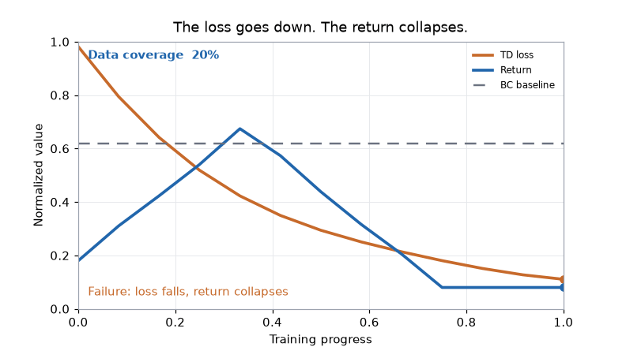

<div align="center">


<p>
  <a href="https://powfu-zwx.github.io/BreakRL/index-en.html"></a>
  <a href="https://github.com/Powfu-zwx/BreakRL/actions/workflows/quality.yml"></a>
  <a href="https://doi.org/10.5281/zenodo.21966485"></a>
  <a href="requirements.txt"></a>
  <a href="LICENSE-CC-BY-4.0"></a>
  <a href="LICENSE-MIT"></a>
</p>

**Learn reinforcement learning through failure**

Each chapter is an ablation: from bandits through PPO and SAC, then offline RL, then toy-task RLHF / DPO / GRPO.

<p>
  <a href="https://powfu-zwx.github.io/BreakRL/demo-en.html"><b>Demo</b></a> ·
  <a href="https://powfu-zwx.github.io/BreakRL/failure-atlas-en.html#atlas-8-offline-loss"><b>Failure Atlas #8</b></a> ·
  <a href="https://powfu-zwx.github.io/BreakRL/notes/offline-rl/offline-rl-en.html"><b>Offline RL</b></a> ·
  <a href="README.md"><b>中文</b></a>
</p>

</div>

BreakRL is a bilingual, failure-first set of RL **lecture notes**. Each chapter explains a mechanism, then removes it so you can see the failure. Chapters 12–14 use toy sequence tasks and two-digit addition; they are not a substitute for production RLHF, DPO, or GRPO training.

Chinese is the source edition and the translation is English. An unsuffixed file is the Chinese source; `-en` is its English translation.

<p align="center">
  <a href="https://powfu-zwx.github.io/BreakRL/demo-en.html"></a>
</p>

<p align="center">
  Open the <a href="https://powfu-zwx.github.io/BreakRL/demo-en.html">minimum demo</a> and drag data coverage: at low coverage the teaching plot lets loss keep falling while return collapses. It does not train a model.
</p>

## Start in three minutes

1. Open the [minimum demo](https://powfu-zwx.github.io/BreakRL/demo-en.html) and drag the coverage slider (a teaching plot; it does not train);
2. Open [Failure Atlas #8](https://powfu-zwx.github.io/BreakRL/failure-atlas-en.html#atlas-8-offline-loss): healthy offline loss, collapsing returns;
3. Read the [Offline RL chapter](https://powfu-zwx.github.io/BreakRL/notes/offline-rl/offline-rl-en.html) — [text PDF](https://powfu-zwx.github.io/BreakRL/offline-rl-text-en.html).

No setup is needed for reading: the site displays saved experiment outputs. To rerun a chapter, open it in Colab from the table below, or install a local environment to edit the notebooks. The catalog below is the rest of the book; start with the loop above, not Chapter 1.

The loop is:

1. Read the chapter text for the problem, formulas, and mechanism;
2. Open the notebook and watch the algorithm on a small task;
3. Compare the ablations: a finished run is not the same as a method that works.

## Learning path

| Stage | Chapters | Focus |
| --- | --- | --- |
| Foundations | 1–3 | Exploration, MDPs, and temporal-difference learning |
| Deep RL | 4–8 | DQN, policy gradients, Actor-Critic, PPO, and SAC |
| New views | 9–11 | Offline RL, model-based RL, and Decision Transformer |
| Toy post-training | 12–14 | RLHF, DPO, and GRPO/RLVR on toy sequence and two-digit-addition tasks |

## Chapters

<!-- chapters:begin -->
| # | Chapter | Text | Experiments | Run |
| --- | --- | --- | --- | --- |
| 1 | Multi-Armed Bandits: Exploration vs Exploitation | [PDF](book/notes/multi-armed-bandit/multi-armed-bandit-en.pdf) | [Notebook](https://powfu-zwx.github.io/BreakRL/notes/multi-armed-bandit/multi-armed-bandit-en.html) | [Colab](https://colab.research.google.com/github/Powfu-zwx/BreakRL/blob/main/book/notes/multi-armed-bandit/multi-armed-bandit-en.ipynb) |
| 2 | Markov Decision Processes | [PDF](book/notes/mdp/mdp-en.pdf) | [Notebook](https://powfu-zwx.github.io/BreakRL/notes/mdp/mdp-en.html) | [Colab](https://colab.research.google.com/github/Powfu-zwx/BreakRL/blob/main/book/notes/mdp/mdp-en.ipynb) |
| 3 | Temporal-Difference Learning | [PDF](book/notes/temporal-difference-learning/temporal-difference-learning-en.pdf) | [Notebook](https://powfu-zwx.github.io/BreakRL/notes/temporal-difference-learning/temporal-difference-learning-en.html) | [Colab](https://colab.research.google.com/github/Powfu-zwx/BreakRL/blob/main/book/notes/temporal-difference-learning/temporal-difference-learning-en.ipynb) |
| 4 | DQN: Neural Value Learning | [PDF](book/notes/dqn/dqn-en.pdf) | [Notebook](https://powfu-zwx.github.io/BreakRL/notes/dqn/dqn-en.html) | [Colab](https://colab.research.google.com/github/Powfu-zwx/BreakRL/blob/main/book/notes/dqn/dqn-en.ipynb) |
| 5 | Policy Gradient / REINFORCE | [PDF](book/notes/policy-gradient/policy-gradient-en.pdf) | [Notebook](https://powfu-zwx.github.io/BreakRL/notes/policy-gradient/policy-gradient-en.html) | [Colab](https://colab.research.google.com/github/Powfu-zwx/BreakRL/blob/main/book/notes/policy-gradient/policy-gradient-en.ipynb) |
| 6 | Actor-Critic / A2C | [PDF](book/notes/actor-critic/actor-critic-en.pdf) | [Notebook](https://powfu-zwx.github.io/BreakRL/notes/actor-critic/actor-critic-en.html) | [Colab](https://colab.research.google.com/github/Powfu-zwx/BreakRL/blob/main/book/notes/actor-critic/actor-critic-en.ipynb) |
| 7 | PPO: Constrained Policy Updates | [PDF](book/notes/ppo/ppo-en.pdf) | [Notebook](https://powfu-zwx.github.io/BreakRL/notes/ppo/ppo-en.html) | [Colab](https://colab.research.google.com/github/Powfu-zwx/BreakRL/blob/main/book/notes/ppo/ppo-en.ipynb) |
| 8 | SAC: Maximum-Entropy Continuous Control | [PDF](book/notes/sac/sac-en.pdf) | [Notebook](https://powfu-zwx.github.io/BreakRL/notes/sac/sac-en.html) | [Colab](https://colab.research.google.com/github/Powfu-zwx/BreakRL/blob/main/book/notes/sac/sac-en.ipynb) |
| 9 | Offline RL: CQL and IQL | [PDF](book/notes/offline-rl/offline-rl-en.pdf) | [Notebook](https://powfu-zwx.github.io/BreakRL/notes/offline-rl/offline-rl-en.html) | [Colab](https://colab.research.google.com/github/Powfu-zwx/BreakRL/blob/main/book/notes/offline-rl/offline-rl-en.ipynb) |
| 10 | Model-Based RL: Dyna-Q | [PDF](book/notes/model-based-rl/model-based-rl-en.pdf) | [Notebook](https://powfu-zwx.github.io/BreakRL/notes/model-based-rl/model-based-rl-en.html) | [Colab](https://colab.research.google.com/github/Powfu-zwx/BreakRL/blob/main/book/notes/model-based-rl/model-based-rl-en.ipynb) |
| 11 | Decision Transformer: RL as Sequence Modeling | [PDF](book/notes/decision-transformer/decision-transformer-en.pdf) | [Notebook](https://powfu-zwx.github.io/BreakRL/notes/decision-transformer/decision-transformer-en.html) | [Colab](https://colab.research.google.com/github/Powfu-zwx/BreakRL/blob/main/book/notes/decision-transformer/decision-transformer-en.ipynb) |
| 12 | RLHF: From Preferences to Rewards | [PDF](book/notes/rlhf/rlhf-en.pdf) | [Notebook](https://powfu-zwx.github.io/BreakRL/notes/rlhf/rlhf-en.html) | [Colab](https://colab.research.google.com/github/Powfu-zwx/BreakRL/blob/main/book/notes/rlhf/rlhf-en.ipynb) |
| 13 | DPO: Preference Optimization without a Reward Model | [PDF](book/notes/dpo/dpo-en.pdf) | [Notebook](https://powfu-zwx.github.io/BreakRL/notes/dpo/dpo-en.html) | [Colab](https://colab.research.google.com/github/Powfu-zwx/BreakRL/blob/main/book/notes/dpo/dpo-en.ipynb) |
| 14 | GRPO and RLVR: Verifiable Rewards | [PDF](book/notes/grpo/grpo-en.pdf) | [Notebook](https://powfu-zwx.github.io/BreakRL/notes/grpo/grpo-en.html) | [Colab](https://colab.research.google.com/github/Powfu-zwx/BreakRL/blob/main/book/notes/grpo/grpo-en.ipynb) |
<!-- chapters:end -->

## The Failure Atlas

When training does not converge, start from the symptom: collapsing returns, rising Q-values with a worsening policy, a healthy offline loss with collapsing returns, or a proxy reward that climbs while true quality falls.

Start with [Failure Atlas #8](https://powfu-zwx.github.io/BreakRL/failure-atlas-en.html#atlas-8-offline-loss) (healthy offline loss, collapsing returns), or [browse the full atlas](https://powfu-zwx.github.io/BreakRL/failure-atlas-en.html). Each entry follows “symptom → mechanism → reproduction → fix.”

## Run the experiments

The site displays saved notebook outputs and does not train models while you read.

**Zero install:** click **Colab** in the chapter table. The first code cell clones this repository, installs the experiment extras, and enters the chapter folder so relative data paths work. Some chapters finish in under a minute on CPU; PPO is on the order of an hour, and Decision Transformer can take several hours on CPU.

To run locally, use Python 3.10 with PyTorch and Gymnasium:

```bash
conda create -n rl_env python=3.10
conda activate rl_env
python -m pip install -r requirements.txt
python -m ipykernel install --user --name rl_env --display-name rl_env
python tools/run_jupyter.py
```

Open `book/notes/<chapter>/<chapter>-en.ipynb` and select the `rl_env` kernel.

## Citation and license

For teaching, learning, or research use, see [CITATION.cff](CITATION.cff). Text, PDFs, TeX, figures, and generated data use [CC BY 4.0](LICENSE-CC-BY-4.0); code in notebooks and helper scripts uses the [MIT License](LICENSE-MIT). Release history is in [docs/CHANGELOG.md](docs/CHANGELOG.md).

See [docs/CONTRIBUTING-en.md](docs/CONTRIBUTING-en.md) for contribution guidance.

## Repository layout

| Path | Purpose |
| --- | --- |
| [`book/`](book/) | Online book: chapters, experiments, demo, and failure atlas |
| [`book/chapters.yml`](book/chapters.yml) | Single chapter list; every catalog table is generated from it |
| [`tools/`](tools/) | Consistency checks, Colab bootstrap, and build helpers |
| [`docs/`](docs/) | Contributing guide, security policy, and changelog |
| [`assets/`](assets/) | README branding and demo GIFs |
