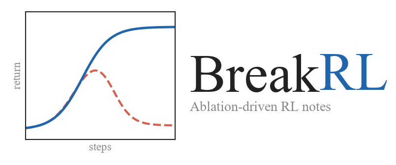

<div align="center">



**用失败学强化学习**

从多臂老虎机到 RLHF、DPO、GRPO/RLVR，每章都把算法放进一组消融实验里

<p>
  <a href="https://powfu-zwx.github.io/BreakRL/"><b>在线阅读</b></a> ·
  <a href="https://powfu-zwx.github.io/BreakRL/demo.html"><b>最小演示</b></a> ·
  <a href="https://powfu-zwx.github.io/BreakRL/failure-atlas.html"><b>失败模式图鉴</b></a> ·
  <a href="README.en.md"><b>English</b></a>
</p>

</div>

BreakRL 是一本以实验为主线的强化学习教材，适合正在学习 RL、准备阅读 RL 论文，或希望用小实验理解算法机制的读者。每章先讲清楚一个算法为什么有效，再去掉其中的关键机制，让你看到它为什么失败。

## 三分钟开始

1. 先看[最小演示](https://powfu-zwx.github.io/BreakRL/demo.html)，用一个滑块理解“损失下降、回报塌缩”；
2. 打开[在线教材](https://powfu-zwx.github.io/BreakRL/)，从第 1 章开始；
3. 再看[失败模式图鉴](https://powfu-zwx.github.io/BreakRL/failure-atlas.html)，按症状查找一个“为什么会失败”的案例。

不需要安装环境：站点展示的是仓库中保存的实验输出。只有想修改代码或重新运行 Notebook 时，才需要准备本地环境。

你会反复经历同一个学习循环：

1. 读正文，理解问题、公式和机制；
2. 看 Notebook，观察算法在小任务上的行为；
3. 对比消融实验，把“能运行”与“真正有效”区分开。

## 学习路线

| 阶段 | 章节 | 重点 |
| --- | --- | --- |
| 基础 | 1–3 | 探索、MDP、时序差分 |
| 深度强化学习 | 4–8 | DQN、策略梯度、Actor-Critic、PPO、SAC |
| 新视角 | 9–11 | 离线 RL、模型式 RL、Decision Transformer |
| LLM 后训练 | 12–14 | RLHF、DPO、GRPO/RLVR |

## 章节

| # | 主题 | 正文 | 实验 |
| --- | --- | --- | --- |
| 1 | 多臂老虎机：探索与利用 | [PDF](notes/multi-armed-bandit/multi-armed-bandit.pdf) | [Notebook](https://powfu-zwx.github.io/BreakRL/notes/multi-armed-bandit/multi-armed-bandit_experiments.html) |
| 2 | 马尔可夫决策过程 | [PDF](notes/mdp/mdp.pdf) | [Notebook](https://powfu-zwx.github.io/BreakRL/notes/mdp/mdp_experiments.html) |
| 3 | 时序差分学习 | [PDF](notes/temporal-difference-learning/temporal-difference-learning.pdf) | [Notebook](https://powfu-zwx.github.io/BreakRL/notes/temporal-difference-learning/temporal-difference-learning_experiments.html) |
| 4 | DQN：神经网络价值学习 | [PDF](notes/dqn/dqn.pdf) | [Notebook](https://powfu-zwx.github.io/BreakRL/notes/dqn/dqn_experiments.html) |
| 5 | Policy Gradient / REINFORCE | [PDF](notes/policy-gradient/pg.pdf) | [Notebook](https://powfu-zwx.github.io/BreakRL/notes/policy-gradient/pg_experiments.html) |
| 6 | Actor-Critic / A2C | [PDF](notes/actor-critic/ac.pdf) | [Notebook](https://powfu-zwx.github.io/BreakRL/notes/actor-critic/ac_experiments.html) |
| 7 | PPO：约束策略更新 | [PDF](notes/ppo/ppo.pdf) | [Notebook](https://powfu-zwx.github.io/BreakRL/notes/ppo/ppo_experiments.html) |
| 8 | SAC：最大熵连续控制 | [PDF](notes/sac/sac.pdf) | [Notebook](https://powfu-zwx.github.io/BreakRL/notes/sac/sac_experiments.html) |
| 9 | 离线强化学习：CQL 与 IQL | [PDF](notes/offline-rl/offline-rl.pdf) | [Notebook](https://powfu-zwx.github.io/BreakRL/notes/offline-rl/offline-rl_experiments.html) |
| 10 | 模型式强化学习：Dyna-Q | [PDF](notes/model-based-rl/model-based-rl.pdf) | [Notebook](https://powfu-zwx.github.io/BreakRL/notes/model-based-rl/model-based-rl_experiments.html) |
| 11 | Decision Transformer | [PDF](notes/decision-transformer/decision-transformer.pdf) | [Notebook](https://powfu-zwx.github.io/BreakRL/notes/decision-transformer/decision-transformer_experiments.html) |
| 12 | RLHF：从偏好到奖励 | [PDF](notes/rlhf/rlhf.pdf) | [Notebook](https://powfu-zwx.github.io/BreakRL/notes/rlhf/rlhf_experiments.html) |
| 13 | DPO：不训奖励模型的偏好优化 | [PDF](notes/dpo/dpo.pdf) | [Notebook](https://powfu-zwx.github.io/BreakRL/notes/dpo/dpo_experiments.html) |
| 14 | GRPO 与 RLVR：可验证奖励 | [PDF](notes/grpo/grpo.pdf) | [Notebook](https://powfu-zwx.github.io/BreakRL/notes/grpo/grpo_experiments.html) |

## 失败模式图鉴

训练不收敛时，可以从症状开始查找：回报崩盘、Q 值上涨但策略变差、离线损失正常但回报塌缩，或者奖励看起来没问题却始终学不动。

[打开 RL 失败模式图鉴](https://powfu-zwx.github.io/BreakRL/failure-atlas.html)：每条记录都按“症状 → 机制 → 复现 → 修复”组织。

## 开始实验

如果只想阅读，不需要安装环境。想运行 Notebook，可以准备 Python 3.10、PyTorch 和 Gymnasium：

```bash
conda create -n rl_env python=3.10
conda activate rl_env
python -m pip install -r requirements.txt
python -m ipykernel install --user --name rl_env --display-name rl_env
python run_jupyter.py
```

然后打开 `notes/<章节>/*_experiments.ipynb`，选择 `rl_env` 内核。站点展示的是仓库中保存的实验输出，不会在阅读时自动训练。

## 引用与许可

如果 BreakRL 对你的学习、教学或研究有帮助，请参考 [CITATION.cff](CITATION.cff) 引用。正文、PDF、TeX、图表和生成数据采用 [CC BY 4.0](LICENSE)；Notebook 和辅助脚本中的代码采用 [MIT](LICENSE-CODE)。

贡献方式见 [CONTRIBUTING.md](CONTRIBUTING.md)。
