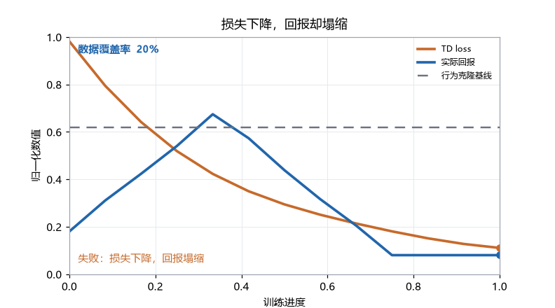

<div align="center">


<p>
  <a href="https://powfu-zwx.github.io/BreakRL/"></a>
  <a href="https://github.com/Powfu-zwx/BreakRL/actions/workflows/quality.yml"></a>
  <a href="https://doi.org/10.5281/zenodo.21966485"></a>
  <a href="requirements.txt"></a>
  <a href="LICENSE-CC-BY-4.0"></a>
  <a href="LICENSE-MIT"></a>
</p>

**用失败学强化学习**

每章都是一次消融：从多臂老虎机到 PPO 与 SAC，再到离线 RL，以及玩具任务上的 RLHF / DPO / GRPO。

<p>
  <a href="https://powfu-zwx.github.io/BreakRL/"><b>在线阅读</b></a> ·
  <a href="https://powfu-zwx.github.io/BreakRL/demo.html"><b>最小演示</b></a> ·
  <a href="https://powfu-zwx.github.io/BreakRL/failure-atlas.html#atlas-8-offline-loss"><b>图鉴第 8 条</b></a> ·
  <a href="https://powfu-zwx.github.io/BreakRL/notes/offline-rl/offline-rl_experiments.html"><b>离线 RL</b></a> ·
  <a href="README.md"><b>English</b></a>
</p>

</div>

BreakRL 是一本双语、失败优先的强化学习教材（英文为默认语言，另有中文版）。每章先讲机制，再去掉它，让你看见失败。第 12–14 章用玩具序列和两位数加法讲机制，不能替代真实的 RLHF、DPO 或 GRPO 训练。

**当前教材：** `main` 上的 v1.2.x。V2 仍是未开工的内部规格，不会替换或清空本仓库。

<p align="center">
  <a href="https://powfu-zwx.github.io/BreakRL/demo.html"></a>
</p>

<p align="center">
  <a href="https://powfu-zwx.github.io/BreakRL/demo.html">打开最小演示</a>，拖动数据覆盖率：覆盖不足时，教学示意里损失可以继续下降，回报却会塌缩。它不训练模型。
</p>

## 三分钟开始

1. 打开[最小演示](https://powfu-zwx.github.io/BreakRL/demo.html)，拖动覆盖率滑块（教学示意，不训练）；
2. 打开[失败模式图鉴第 8 条](https://powfu-zwx.github.io/BreakRL/failure-atlas.html#atlas-8-offline-loss)：离线损失正常、回报塌缩；
3. 阅读[离线强化学习章](https://powfu-zwx.github.io/BreakRL/notes/offline-rl/offline-rl_experiments.html) — [正文 PDF](https://powfu-zwx.github.io/BreakRL/offline-rl-text.html)。

不需要安装：站点展示的是仓库中保存的实验输出。想重跑某一章，从下面的章节表打开 Colab；只有要在本地改 Notebook 时，才需要 conda 环境。下面的目录是全书其余部分；请先走完上面这一环，而不是从第 1 章开始。

学习循环是：

1. 先读正文，弄清问题、公式和机制；
2. 再看 Notebook，观察算法在小任务上的行为；
3. 对比消融：能跑完不等于方法有效。

## 学习路线

| 阶段 | 章节 | 重点 |
| --- | --- | --- |
| 基础 | 1–3 | 探索、MDP、时序差分 |
| 深度强化学习 | 4–8 | DQN、策略梯度、Actor-Critic、PPO、SAC |
| 新视角 | 9–11 | 离线 RL、模型式 RL、Decision Transformer |
| 玩具后训练 | 12–14 | 玩具序列与两位数加法上的 RLHF、DPO、GRPO/RLVR |

## 章节

| # | 主题 | 正文 | 实验 | 运行 |
| --- | --- | --- | --- | --- |
| 1 | 多臂老虎机：探索与利用 | [PDF](book/notes/multi-armed-bandit/multi-armed-bandit.pdf) | [Notebook](https://powfu-zwx.github.io/BreakRL/notes/multi-armed-bandit/multi-armed-bandit_experiments.html) | [Colab](https://colab.research.google.com/github/Powfu-zwx/BreakRL/blob/main/book/notes/multi-armed-bandit/multi-armed-bandit_experiments.ipynb) |
| 2 | 马尔可夫决策过程 | [PDF](book/notes/mdp/mdp.pdf) | [Notebook](https://powfu-zwx.github.io/BreakRL/notes/mdp/mdp_experiments.html) | [Colab](https://colab.research.google.com/github/Powfu-zwx/BreakRL/blob/main/book/notes/mdp/mdp_experiments.ipynb) |
| 3 | 时序差分学习 | [PDF](book/notes/temporal-difference-learning/temporal-difference-learning.pdf) | [Notebook](https://powfu-zwx.github.io/BreakRL/notes/temporal-difference-learning/temporal-difference-learning_experiments.html) | [Colab](https://colab.research.google.com/github/Powfu-zwx/BreakRL/blob/main/book/notes/temporal-difference-learning/temporal-difference-learning_experiments.ipynb) |
| 4 | DQN：神经网络价值学习 | [PDF](book/notes/dqn/dqn.pdf) | [Notebook](https://powfu-zwx.github.io/BreakRL/notes/dqn/dqn_experiments.html) | [Colab](https://colab.research.google.com/github/Powfu-zwx/BreakRL/blob/main/book/notes/dqn/dqn_experiments.ipynb) |
| 5 | Policy Gradient / REINFORCE | [PDF](book/notes/policy-gradient/pg.pdf) | [Notebook](https://powfu-zwx.github.io/BreakRL/notes/policy-gradient/pg_experiments.html) | [Colab](https://colab.research.google.com/github/Powfu-zwx/BreakRL/blob/main/book/notes/policy-gradient/pg_experiments.ipynb) |
| 6 | Actor-Critic / A2C | [PDF](book/notes/actor-critic/ac.pdf) | [Notebook](https://powfu-zwx.github.io/BreakRL/notes/actor-critic/ac_experiments.html) | [Colab](https://colab.research.google.com/github/Powfu-zwx/BreakRL/blob/main/book/notes/actor-critic/ac_experiments.ipynb) |
| 7 | PPO：约束策略更新 | [PDF](book/notes/ppo/ppo.pdf) | [Notebook](https://powfu-zwx.github.io/BreakRL/notes/ppo/ppo_experiments.html) | [Colab](https://colab.research.google.com/github/Powfu-zwx/BreakRL/blob/main/book/notes/ppo/ppo_experiments.ipynb) |
| 8 | SAC：最大熵连续控制 | [PDF](book/notes/sac/sac.pdf) | [Notebook](https://powfu-zwx.github.io/BreakRL/notes/sac/sac_experiments.html) | [Colab](https://colab.research.google.com/github/Powfu-zwx/BreakRL/blob/main/book/notes/sac/sac_experiments.ipynb) |
| 9 | 离线强化学习：CQL 与 IQL | [PDF](https://powfu-zwx.github.io/BreakRL/offline-rl-text.html) | [Notebook](https://powfu-zwx.github.io/BreakRL/notes/offline-rl/offline-rl_experiments.html) | [Colab](https://colab.research.google.com/github/Powfu-zwx/BreakRL/blob/main/book/notes/offline-rl/offline-rl_experiments.ipynb) |
| 10 | 模型式强化学习：Dyna-Q | [PDF](book/notes/model-based-rl/model-based-rl.pdf) | [Notebook](https://powfu-zwx.github.io/BreakRL/notes/model-based-rl/model-based-rl_experiments.html) | [Colab](https://colab.research.google.com/github/Powfu-zwx/BreakRL/blob/main/book/notes/model-based-rl/model-based-rl_experiments.ipynb) |
| 11 | Decision Transformer | [PDF](book/notes/decision-transformer/decision-transformer.pdf) | [Notebook](https://powfu-zwx.github.io/BreakRL/notes/decision-transformer/decision-transformer_experiments.html) | [Colab](https://colab.research.google.com/github/Powfu-zwx/BreakRL/blob/main/book/notes/decision-transformer/decision-transformer_experiments.ipynb) |
| 12 | RLHF：从偏好到奖励 | [PDF](book/notes/rlhf/rlhf.pdf) | [Notebook](https://powfu-zwx.github.io/BreakRL/notes/rlhf/rlhf_experiments.html) | [Colab](https://colab.research.google.com/github/Powfu-zwx/BreakRL/blob/main/book/notes/rlhf/rlhf_experiments.ipynb) |
| 13 | DPO：不训奖励模型的偏好优化 | [PDF](book/notes/dpo/dpo.pdf) | [Notebook](https://powfu-zwx.github.io/BreakRL/notes/dpo/dpo_experiments.html) | [Colab](https://colab.research.google.com/github/Powfu-zwx/BreakRL/blob/main/book/notes/dpo/dpo_experiments.ipynb) |
| 14 | GRPO 与 RLVR：可验证奖励 | [PDF](book/notes/grpo/grpo.pdf) | [Notebook](https://powfu-zwx.github.io/BreakRL/notes/grpo/grpo_experiments.html) | [Colab](https://colab.research.google.com/github/Powfu-zwx/BreakRL/blob/main/book/notes/grpo/grpo_experiments.ipynb) |

## 失败模式图鉴

训练不收敛时，从症状查起：回报崩盘、Q 值上涨但策略变差、离线损失正常但回报塌缩，或代理奖励上涨而真实质量下降。

先看[图鉴第 8 条](https://powfu-zwx.github.io/BreakRL/failure-atlas.html#atlas-8-offline-loss)（离线损失正常、回报塌缩），或[浏览完整图鉴](https://powfu-zwx.github.io/BreakRL/failure-atlas.html)。每条记录都按“症状 → 机制 → 复现 → 修复”组织。

## 开始实验

站点展示的是仓库中保存的实验输出，阅读时不会训练模型。

**免安装：** 在章节表中点 **Colab**。第一个代码单元会克隆本仓库、安装实验依赖，并进入该章目录，使相对数据路径生效。有的章在 CPU 上不到一分钟；PPO 大约一小时量级，Decision Transformer 在 CPU 上可能要数小时。

想在本地运行，可以准备 Python 3.10、PyTorch 和 Gymnasium：

```bash
conda create -n rl_env python=3.10
conda activate rl_env
python -m pip install -r requirements.txt
python -m ipykernel install --user --name rl_env --display-name rl_env
python scripts/run_jupyter.py
```

然后打开 `book/notes/<章节>/*_experiments.ipynb`，选择 `rl_env` 内核。

## 引用与许可

如果 BreakRL 对你的学习、教学或研究有帮助，请参考 [CITATION.cff](CITATION.cff) 引用。正文、PDF、TeX、图表和生成数据采用 [CC BY 4.0](LICENSE-CC-BY-4.0)；Notebook 和辅助脚本中的代码采用 [MIT](LICENSE-MIT)。版本记录见 [docs/CHANGELOG.md](docs/CHANGELOG.md)。

贡献方式见 [docs/CONTRIBUTING.zh.md](docs/CONTRIBUTING.zh.md)。

## 仓库结构

| 路径 | 用途 |
| --- | --- |
| [`book/`](book/) | 在线书：章节、实验、演示与失败图鉴 |
| [`scripts/`](scripts/) | 一致性检查、Colab 引导与构建辅助脚本 |
| [`docs/`](docs/) | 贡献指南、安全策略与变更记录 |
| [`assets/`](assets/) | README 品牌资源与演示 GIF |
